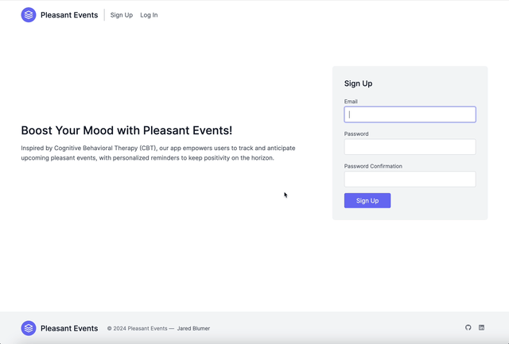

# Happeni

Inspired by Cognitive Behavioral Therapy (CBT), Happeni empowers users to create happiness by choosing and anticipating upcoming pleasant events. With personalized reminders, we help you stay focused on the positive moments that brighten your life.

View the app at [Happeni.com](https://happeni.com/)



## Overview

This Ruby on Rails application allows users to log pleasant events they are looking forward to and receive regular reminders. The app is designed to help users maintain a positive outlook by focusing on enjoyable future activities, a technique often used in CBT to improve mental well-being.

## Features

- **Event Tracking** – Add and manage upcoming pleasant events with dates and details.
- **Reminders** – Personalized reminders to help you anticipate good things.
- **User-Friendly UI** – Clean, responsive interface styled with TailwindCSS.
- **Account Management** – Sign-up, login, email confirmation (Devise).
- **Spam Protection** – Google reCAPTCHA integration on sign-up forms.
- **Email Delivery** – SendGrid integration for transactional emails.

## Tech Stack


- **Ruby on Rails 7.2**
- **PostgreSQL**
- **TailwindCSS**
- **Devise** – authentication with confirmation
- **Hotwire (Turbo + Stimulus)**
- **SendGrid** – for email delivery
- **reCAPTCHA** – for spam prevention
- **RSpec** – test suite
- **FactoryBot & Faker** – test data generation
- **Shoulda Matchers** – model spec helpers

## Running the Application

To run the application, you'll need to start two separate processes: one for the Rails server and one for TailwindCSS to watch for changes and compile styles.

Follow these steps:

### 1. **Clone and Install Dependencies**

Make sure you have the necessary dependencies installed:

```bash
git clone https://github.com/jaredblumer/happeni
cd happeni
bundle install
```

### 2. Set Up Environment Variables

Create a `.env` file (or use `credentials.yml.enc`) for:

- `SENDGRID_API_KEY`
- `RECAPTCHA_SITE_KEY`
- `RECAPTCHA_SECRET_KEY`

### 3. Set Up the Database

```bash
bin/rails db:create db:migrate db:seed
```

### 4. Run TailwindCSS Watcher

In a first terminal window, run the TailwindCSS watcher to compile the CSS when changes are made:

```bash
bin/rails tailwindcss:watch
```

This command will watch for any changes to your TailwindCSS files and compile them automatically.

### 5. Start the Rails Server

In the second terminal window, run the Rails server:
```bash
bin/rails server
```

### 6. Access the Application

Once both processes are running, open your browser and navigate to `http://localhost:3000`
