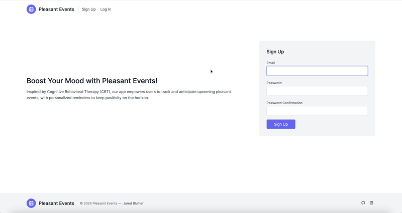

# Happeni

Inspired by Cognitive Behavioral Therapy (CBT), Happeni empowers users to create happiness by choosing and anticipating upcoming pleasant events. With personalized reminders, we help you stay focused on the positive moments that brighten your life.

View the app at 



## Overview

This Ruby on Rails application allows users to log pleasant events they are looking forward to and receive regular reminders. The app is designed to help users maintain a positive outlook by focusing on enjoyable future activities, a technique often used in CBT to improve mental well-being.

## Features

- **Event Tracking:** Users can add and manage upcoming pleasant events by entering event names and dates.
- **Reminders:** The app provides regular reminders for upcoming events to keep users engaged and looking forward to their activities.
- **User-Friendly Interface:** Simple and intuitive design that makes tracking events easy and enjoyable.

## To-Do

:construction: Happeni is currently under construction. :construction:

The following tasks are yet to be completed:

- **Create Daily/Weekly Reminder Email:** Build daily reminder email listing upcoming future events and the number of days until the events arrive.
- **Write Tests:** Utilize Capybara and RSpec to write tests.
- **Create Account Page:** Create account page to update password, change password, and delete account.

## Running the Application

To run the application, you'll need to start two separate processes: one for the Rails server and one for TailwindCSS to watch for changes and compile styles.

Follow these steps:

### 1. **Install Dependencies**

Make sure you have the necessary dependencies installed:

```bash
bundle install
```

### 2. Run TailwindCSS Watcher

In a first terminal window, run the TailwindCSS watcher to compile the CSS when changes are made:

```bash
bin/rails tailwindcss:watch
```

This command will watch for any changes to your TailwindCSS files and compile them automatically.

### 3. Start the Rails Server

In the second terminal window, run the Rails server:
```bash
bin/rails server
```

### 4. Access the Application

Once both processes are running, open your browser and navigate to `http://localhost:3000`
